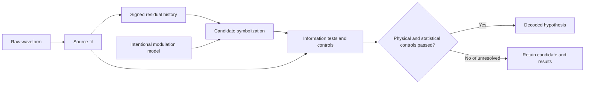

# GW-COM — gravitational wave communication

Sean Brady's program is to investigate intentional information in gravitational
waves, beginning with orbital modulation at intervals `2,3,5,7,11,13,17` and later
considering larger primes in a second strength layer. This branch is organized
around five layers and a retained history, never a single anomaly score.

## Current seven-prime results

The current payload is **2,3,5,7,11,13,17**. The [corrected C4 run](../SAM_REVIEW/campaigns/GW_COM_PIPELINE2/RESULT.md) and [continuous binary experiment](../SAM_REVIEW/campaigns/GW_COM_CONTINUOUS1/REPORT.md) retain the original completed results.

[Exactly three follow-up tests](../SAM_REVIEW/campaigns/GW_COM_THREE_TESTS1/REPORT.md) are now complete: continuous noise/SNR sweep, SI strain/detectability, and chirp/precession-like false positives. Both seeds decode at σ=0.01 and 0.05; neither decodes at 0.20. Six matched noise controls and both natural nuisances produce no repeated packet. The scaling report distinguishes ideal known-waveform SNR, receiver recovery, control work and radiation losses. No further experiment is running. Earlier six-value experiments below remain preserved historical results.

Publication and reproduction scope: [PUBLICATION.md](PUBLICATION.md).

## Five layers

| Layer | Responsibility | Retained output |
|---|---|---|
| [1. GW carrier model](01_carrier/README.md) | Binary/orbital source; expected phase evolution, amplitude, polarization, chirp, precession | Source fits, predicted waveforms, parameters, alternatives, uncertainty and selection rule |
| [2. Intentional modulation model](02_modulation/README.md) | Phase, frequency, amplitude, timing, polarization, pulse trains | Explicit control hypotheses and forward responses, with source and observer quantities kept separate |
| [3. Residual extractor](03_residual/README.md) | Subtract the best physical source model under a stated fit criterion | Signed, time-ordered residual history for each retained fit and processing variant |
| [4. Information tests](04_information/README.md) | Periodicity, entropy, compression, symbol alphabets, repetition, synchronization markers, error-correcting structure | Candidate symbolizations and the complete physical/statistical control record |
| [5. Decoder](05_decoder/README.md) | Decode only candidates that survive their physical and statistical controls | Decoded hypotheses, alternatives, ambiguity and links back to the original data |

The essential retained chain is:

**raw waveform → source fit → residual history → candidate symbolization → decoded hypothesis**

Information tests and control decisions are attached to that chain. Multiple
fits, residuals, alphabets and decoder hypotheses form explicit branches with
shared parents. A rejected or unresolved branch remains inspectable.

## Evidence and decoder admission

[EVIDENCE_CONTRACT.md](EVIDENCE_CONTRACT.md) defines the retained records,
parent links, content hashes, sample provenance and decoder-admission rule.
[PROGRAM.json](PROGRAM.json) indexes the layers and the preserved first demo.
[AGENTS.md](AGENTS.md) applies these rules to further work here.

The fit criterion, candidate search and physical/statistical controls belong to
each experiment's declared contract. This organization introduces no numerical
significance threshold or automatic meaning assignment. A failed, incomplete
or unrun control leaves candidate decoding unavailable. New choices are new
versions, with earlier attempts retained.

## Executable pipeline and preserved demonstration

The [first five-layer GEN3 run](../SAM_REVIEW/campaigns/GW_COM_PIPELINE1/RESULT.md)
is complete. Clean/noisy prime messages and an alternate message passed their
declared controls and decoded; clean/noisy unmodulated and drift-only cases were
blocked. It retains all three carrier fits and signed residual histories.
The [detailed findings report](../SAM_REVIEW/campaigns/GW_COM_PIPELINE1/DETAILED_REPORT.md)
covers the equations, case parameters, fit alternatives, information diagnostics,
control decisions, execution evidence and proposed successors.
The [runtime](runtime) implements the C4-scoped layers and decoder gate; the
[run contract](../SAM_REVIEW/campaigns/GW_COM_PIPELINE1/CONTRACT.json) declares
their assumptions and numerical criteria. Nine gate tests and independent
exact reconstruction pass. Physical chirp/precession, multi-polarization,
detector models and error-correcting-code search remain unimplemented.

The completed [interval demonstration](../SAM_REVIEW/campaigns/GW_COM_INTERVAL1/RESULT.md)
remains at its original path with its source files, hashes, native receipts and
classification intact. It recovered two transmitted prime packets and passed
20 mild-noise trials. Its receiver operated on an absolute-amplitude envelope
and knew the framing format. The signed source waveform was retained.

That demo is indexed as **a controlled transmitter/receiver demonstration**.
It has no best physical source fit or signed fitted-residual stage and has not
passed this new pipeline's physical/statistical candidate controls. Its decoder
output is demonstration evidence, not an admitted candidate hypothesis under
the five-layer process. We do not retroactively change its historical result.

The first successor now fits the toy carrier, retains signed residuals and
alternatives, and runs declared information tests and controls before enabling
the candidate decoder. This is an executable dimensionless pipeline; the full
physical source/detector model is still future work. Research calculations use
current STARBREAKER DomainSession operations and source-bound adapters under
the root rules.

Sean Brady is originator and conceptual director of this architecture and its
full-history requirement. OpenAI ChatGPT and Codex are AI research collaborators.
