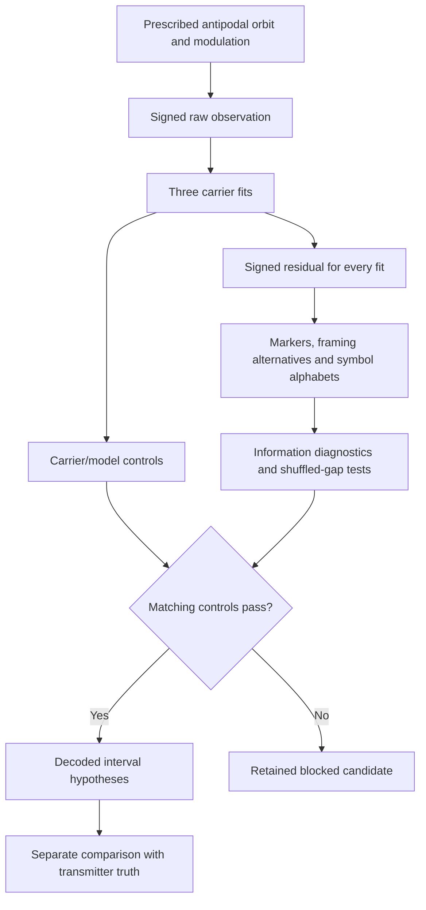

# GW-COM: detailed report on the first five-layer GEN3 experiment

**Report date:** 2026-09-17  
**Branch:** `gw-com`  
**Campaign:** `GW_COM_PIPELINE1`, preserved execution `run001`  
**Research mode:** exploratory mathematical research  
**Originator / conceptual director:** Sean Brady  
**AI research collaborators:** OpenAI ChatGPT and Codex

## 1. Principal finding

The first executable five-layer GW-COM experiment recovered the interval
sequence **2, 5, 7, 11, 13, 17** from both a clean signal and a signal with
bounded measurement noise, reduced gain and a DC offset. Recovery occurred
after source fitting, signed residual extraction, candidate symbolization,
and the declared carrier/model and statistical controls. A separate even-number
message also recovered correctly. Three unmodulated/noise/drift controls were
blocked before decoding.

**The test result suggests the concept is possible.**

This finding applies to the implemented dimensionless, sampled two-body C4
source and its declared readout model. The experiment now supplies an executable
research chain with traceable intermediate evidence. Physical actuation,
continuous binary dynamics and a calibrated gravitational-wave detector remain
extensions of that chain.

The complete retained relationship is:

**raw waveform → source fit → residual history → candidate symbolization → decoded hypothesis**

The principal numerical record is [RUN_RESULT.json](run001/records/RUN_RESULT.json).
The experimental assumptions and admission criteria were declared in
[CONTRACT.json](CONTRACT.json), with implementation and contract copies saved
before execution in the [method snapshot](run001/METHOD.json).

## 2. Research question and conceptual origin

Sean Brady proposed manipulating two orbiting objects so their outgoing wave
carries a recognizable prime-number message. The first requested layer was
timing: equal control events separated by intervals proportional to
`2, 5, 7, 11, 13, 17`. A second proposed layer would encode larger primes in
wave strength.

Sean subsequently specified five distinct research layers:

1. A GW carrier model containing the binary/orbital source and its expected
   phase evolution, amplitude, polarization, chirp and precession.
2. An intentional modulation model covering phase, frequency, amplitude,
   timing, polarization and pulse trains.
3. A residual extractor that subtracts the best admitted source model and
   retains the unexplained signed, time-ordered component.
4. Information tests for periodicity, entropy, compression, symbol alphabets,
   repetition, synchronization and error-correcting structure.
5. A decoder available only after a candidate survives physical and
   statistical controls.

The defining methodological requirement was to retain the entire history and
its alternatives, rather than reduce a candidate to one anomaly score.

The bounded question for this execution was:

> Can a waveform generated from prescribed orbital-radius modulation retain
> the requested interval sequence after carrier fitting and signed subtraction,
> while the same analysis withholds decoding from unmodulated, noisy and
> drifting carrier controls?

The particular radial profile, calibration windows, model family, framing
rules and statistical criterion are Codex's declared first implementation of
the owner's concept. They are specified experiment choices, not a universal
definition of gravitational-wave communication.

## 3. Relationship to the earlier interval demonstration

The preserved [GW_COM_INTERVAL1 demonstration](../GW_COM_INTERVAL1/RESULT.md)
established a simpler encoder/receiver path. It generated equal radial markers,
decoded two repeated prime packets from an amplitude-envelope view, and
recovered both packets in 20 seeded mild Gaussian-noise trials with varied
delay and gain. It retained the signed source waveform but did not perform
the new source-fit and signed-residual stages.

`GW_COM_PIPELINE1` adds those stages, explicit information records and an
enforced decoder-admission gate. The earlier artifacts and classification
remain unchanged.

The two noise experiments must be distinguished:

| Experiment | Noise evidence |
|---|---|
| Original interval demo | 20 Gaussian-noise trials; sigma 0.04 before channel gain |
| Five-layer pipeline | One bounded-noise prime case, seed 81, and one bounded-noise unmodulated case, seed 82; both use a maximum absolute measurement noise of 0.01 |

The pipeline's 99 permutations per case are shuffled-interval statistical
controls. They are not 99 independently generated noisy waveforms.

## 4. Implemented five-layer structure

| Layer | Executed in this run | Retained extensions |
|---|---|---|
| Carrier | Fixed C4 phase law; fitted signed amplitude, DC offset and linear amplitude drift | Continuous orbit, chirp, precession, additional polarizations and detector response |
| Modulation | Identical prescribed radial excursions with interval timing | Other control families and the larger-prime strength layer |
| Residual | Exact signed subtraction for all three fit alternatives, with raw sample indices | Additional physical models and nontrivial sampling/filtering operations |
| Information | Marker-lag periodicity, empirical alphabet probabilities, entropy, compression, repetition, synchronization and gap-order permutation tests | Error-correcting-code search and broader physical/noise nulls |
| Decoder | Versioned control admission, integer-interval hypotheses, alternatives and raw sample support | Other grammars, ambiguity handling for harder data and additional channels |

Executable modules are cataloged under [GW_COM/runtime](../../../GW_COM/runtime).
The [evidence contract](../../../GW_COM/EVIDENCE_CONTRACT.md) governs their
shared records.

## 5. Source model and intentional modulation

### 5.1 Two-body source

The source follows the established H000733 dimensionless antipodal orbit-wave
construction. Two unit-weight bodies occupy opposite positions:

\[
\mathbf{x}_{\pm,k}=\pm r_k\mathbf{u}_k,
\qquad
\mathbf{u}_k\in\{(1,0),(0,1),(-1,0),(0,-1)\}.
\]

The direction advances by a quarter turn on each discrete source tick.
The trace-free quadrupole is

\[
Q_k=\sum_{\pm}\left(\mathbf{x}_{\pm,k}\mathbf{x}_{\pm,k}^{T}
-\frac{r_k^2}{3}I_3\right).
\]

The implementation uses its signed planar projection

\[
q_k=(Q_k)_{xx}-(Q_k)_{yy}=2(x_k^2-y_k^2),
\]

and the second-difference observable

\[
w_k=q_{k-1}-2q_k+q_{k+1}.
\]

The trace terms cancel in the projection. Native arithmetic calculates the
projection and differences from positions; markers are not inserted directly
into an otherwise independent waveform. Repeated identical source stencils
reuse their exact computed values.

The baseline radius is one. With the saved observation indexing, the
unmodulated carrier is the alternating signed sequence `8, -8, 8, -8, …`.
This is the discrete source observable used in the experiment. No SI strain,
orbital mass scale or detector calibration is assigned to it.

### 5.2 Equal radial control events

Each event applies the same radius increment across nine source samples:

\[
\delta r=\frac{1}{128}[0,1,3,6,8,6,3,1,0].
\]

The peak increment is `1/16`, or 6.25% of the baseline radius. The two bodies
remain antipodal. The motion is prescribed; this run does not integrate the
force and energy needed to produce it.

The information-bearing choice is the event timing. Control strength is held
fixed within each transmitted case. The larger-prime strength channel has
not yet been added.

### 5.3 Framing and timing

Each packet contains four opening markers separated by one reference interval,
followed by six data intervals. The transmitter's unit is 16 samples. Two
complete packets are generated, separated by a 23-unit guard interval.
The receiver knows the framing format but estimates the unit from the opening
markers; it receives neither the intended message nor the event schedule.

The source places its first event at tick 256, leaving declared quiet
calibration and holdout prefixes. The first clean observation marker is at raw
sample 255 because the observable is indexed over interior source stencils.
The observation stores its first arrival tick as metadata; there is no
propagation simulation or synthetic time-delay estimation in this run.

## 6. Observation cases

The sampled readout is constructed as

\[
y_i=g\left[w_i+d\,i(-1)^i\right]+c+\epsilon_i.
\]

Here `g` is channel gain, `c` is DC offset, `d` is an injected carrier-amplitude
drift nuisance, and `epsilon` is bounded measurement noise. The nuisance drift
is part of the admitted readout/carrier family; it is not a simulated chirp
or a dynamically derived change in the orbit.

| Case | Interval payload | Modulated? | Gain | DC offset | Drift per sample before gain | Noise bound |
|---|---|---|---:|---:|---:|---:|
| `prime_clean` | `2,5,7,11,13,17` | Yes | 1 | 0 | 0 | 0 |
| `prime_noisy` | `2,5,7,11,13,17` | Yes | 1/2 | 1/5 | 0 | 1/100 |
| `alternate_clean` | `4,6,8,10,12,14` | Yes | 2 | 0 | 0 | 0 |
| `unmodulated_clean` | None transmitted | No | 1 | 0 | 0 | 0 |
| `unmodulated_noisy` | None transmitted | No | 1 | 0 | 0 | 1/100 |
| `drift_only` | None transmitted | No | 1 | 1/5 | 1/400 | 0 |

For each noisy sample, an integer is drawn uniformly from `-100` through `100`
and multiplied by the declared noise bound divided by 100. The noisy prime
case uses seed 81; the noisy unmodulated case uses seed 82. These are exact
rational measurement inputs, not floating-point noise later approximated as
rational values.

The prime and control records contain 2,511 observation samples each. The
alternate-message record contains 2,479 samples. The controls contain the
unmodulated carrier, with the stated readout nuisance where applicable; none
is a standalone noise-only record.

## 7. Carrier fitting and model selection

### 7.1 Candidate family

With `b_i=(-1)^i`, the three admitted carrier models are

\[
\begin{aligned}
M_1(i)&=A b_i,\\
M_2(i)&=A b_i+C,\\
M_3(i)&=A b_i+C+D\frac{i}{128}b_i.
\end{aligned}
\]

The phase progression is fixed by the C4 model. There is no separate search
over frequency, chirp rate, precession or physical polarization.

Exact least squares fits samples `[0,128)`. A distinct quiet holdout uses
`[128,192)`. The selected fit is the model with the fewest parameters whose
maximum absolute holdout residual does not exceed

\[
B=\max(10^{-12},3\epsilon_{\max}).
\]

This is the declared model-selection criterion. It is a bounded-noise adequacy
rule, not a fitted confidence interval. All coefficients, predictions and
residual histories are retained for all models, including inadequate ones.

### 7.2 Clean and noisy message fits

The clean prime case recovers `A=8` exactly. All three models pass the quiet
holdout, with extra coefficients zero; the simplest model is selected. The
gain-two alternate message similarly recovers `A=16`.

For the noisy prime case, the amplitude-only fit leaves the DC offset in the
residual and fails the 0.03 holdout bound. The amplitude-plus-DC model passes:

\[
\widehat A=\frac{127989}{32000},
\qquad
\widehat C=\frac{127959}{640000}.
\]

Its maximum holdout residual is `1281/128000`, approximately 0.0100078.
The drift-capable alternative also passes, but is more complex. Both adequate
alternatives preserve the same repeated candidate message.

| Case / model | Maximum absolute holdout residual | Bound | Adequate? |
|---|---:|---:|---|
| Clean prime / amplitude | 0 | `10^-12` | Yes |
| Noisy prime / amplitude | `33591/160000` ≈ 0.209944 | 0.03 | No |
| Noisy prime / amplitude + DC | `1281/128000` ≈ 0.0100078 | 0.03 | Yes |
| Noisy prime / amplitude + DC + drift | `126319/12480000` ≈ 0.0101217 | 0.03 | Yes |
| Drift-only / amplitude | `413/800` = 0.51625 | `10^-12` | No |
| Drift-only / amplitude + DC | `127/400` = 0.3175 | `10^-12` | No |
| Drift-only / amplitude + DC + drift | 0 | `10^-12` | Yes |

### 7.3 Drift-only finding

The drift-capable fit recovers

\[
A=8,\qquad C=1/5,\qquad D=8/25.
\]

Because its drift basis is `i/128`, the fitted coefficient represents a
per-sample slope `(8/25)/128 = 1/400`, matching the injected nuisance.
The complete selected residual is exactly zero.

This is a concrete example of the intended carrier/residual separation:
source/readout structure admitted by the model is absorbed into the fit, and
the residual supplies no repeated-message candidate. The failed simpler fits
remain available for inspection alongside the selected fit.

The exact coefficients and predictions are linked through each case's
[run-result lineage](run001/records/RUN_RESULT.json).

## 8. Signed residual extraction and symbol candidates

For each model, GEN3 computes

\[
r_i=y_i-\widehat y_i.
\]

The record retains every signed value, its raw observation index, the fit
identity and a validity mask. There is no filtering, whitening or resampling
in this execution. Independent exact checks confirm `raw = prediction +
residual` at every sample.

Marker detection uses absolute residual magnitude as a derived selection view,
with threshold `0.03 × abs(fitted carrier amplitude)`. The underlying signed
residual and each marker's signed sample support remain retained. Above-threshold
samples separated by at most two sample indices are grouped. Groups with 3–11
active samples are admitted; other groups remain in the rejection record.
The largest absolute residual within each group supplies the peak time.

For the clean prime case, the threshold is `6/25 = 0.24`; its largest absolute
residual is `921/1024`, approximately 0.899414. The selected noisy prime case
uses threshold `383967/3200000`, approximately 0.119990. Both identify the
same 20 marker times and recover a 16-sample synchronization unit.

The first packet's data support is particularly direct:

| Raw sample span | Measured separation | Separation / 16 | Candidate symbol |
|---|---:|---:|---|
| 303 → 335 | 32 | 2 | S0 |
| 335 → 415 | 80 | 5 | S1 |
| 415 → 527 | 112 | 7 | S2 |
| 527 → 703 | 176 | 11 | S3 |
| 703 → 911 | 208 | 13 | S4 |
| 911 → 1183 | 272 | 17 | S5 |

The second packet supplies the same sequence on distinct sample spans.
All possible ten-marker framing starts are searched. Synchronization and
interval quantization use the declared tolerance `3/25 = 0.12`. Candidate
records retain timing ratios, alphabet bins, abstract symbol names, framing
alternatives and sample support before a decoded hypothesis is emitted.

Evidence: [clean symbolization](run001/records/prime_clean.symbols0.data.json)
and [noisy symbolization](run001/records/prime_noisy.symbols1.data.json).

## 9. Information tests and their findings

### 9.1 Repetition and synchronization

Each of the three transmitted cases produces two disjoint packets with the
same interval-symbol sequence. Overlapping framing windows are not allowed
to inflate the repetition count. The unmodulated, noisy unmodulated and
drift-only controls produce no repeated packet candidate.

The opening synchronization pattern is supplied as a protocol assumption.
The inferred interval unit and actual payload values come from the waveform.
There is no primality test and no comparison with the expected prime list
inside fitting, candidate construction, statistical admission or decoding.

### 9.2 Periodicity

The information record stores the complete histogram of pairwise marker lags.
This retains timing structure at different separations, including repeated
packet offsets. It is a descriptive timing diagnostic in this run. There is
no separate Fourier-periodicity significance claim or periodicity threshold
used for decoder admission.

### 9.3 Entropy and symbol alphabets

Each admitted signal has six abstract symbols, appearing twice across the
two packets. Their exact empirical probabilities are all `1/6`. The derived
Shannon value is therefore

\[
H=-\sum_{j=1}^{6}\frac16\log_2\frac16
=\log_2 6
\approx 2.584962500721156\ \text{bits/symbol}.
\]

The clean prime, noisy prime and even-number messages have the same value.
That is useful: a one-symbol frequency summary does not capture the repeated
ordered packet, and it does not identify the numerical values as primes.
The full sequence and its timing-to-integer mapping are retained separately.

For controls with no candidate symbols, the implementation reports an empty
probability map and zero diagnostic entropy. That is an empty-record convention,
not an entropy estimate for the entire raw noise waveform.

### 9.4 Compression

The admitted abstract symbol stream is serialized with comma-separated labels
and a pipe separator between frames. It contains 35 UTF-8 bytes. Default zlib
compression, including its header, produces 29 bytes in each admitted case.

The measurement describes that exact short serialization. It is retained as
a diagnostic and is not used as an admission criterion. The prime and even
messages compress identically because their abstract repeated-symbol patterns
are identical; the actual interval magnitudes remain in the alphabet mapping.

An empty control stream contains zero input bytes and compresses to eight
bytes of format overhead. No compression ratio is assigned to an empty input.

### 9.5 Error-correcting structure

No parity relation, code family or error-correction search is implemented.
The record explicitly marks this diagnostic as not implemented. Packet
repetition supplies repeated observations, and no symbol repair was applied.
The decoded records retain empty correction lists.

Evidence: [prime information record](run001/records/prime_clean.information.data.json)
and [alternate-message information record](run001/records/alternate_clean.information.data.json).

## 10. Statistical control and interpretation

The test statistic is the largest number of disjoint identically symbolized
packets found by the complete framing search. For each case, the analysis
constructs 99 permutations of the detected gap order, preserving the gap
multiset. It reconstructs marker positions and reruns the same complete search
on each permutation, including selection of the maximum repetition count.

The declared conditional null is exchangeability of the detected interval
order. The retained permutation seed is `20260917`. The rank calculation is

\[
p_{\mathrm{rank}}=
\frac{1+\#\{T_{\mathrm{null}}\geq T_{\mathrm{observed}}\}}
{1+99}.
\]

Ties count as exceedances. Statistical admission requires both at least two
disjoint repeated packets and rank at most `1/20 = 0.05`.

| Case family | Observed maximum | Largest shuffled maximum | Exceedances | Rank |
|---|---:|---:|---:|---:|
| Clean prime | 2 | 1 | 0 | 1/100 |
| Noisy prime | 2 | 1 | 0 | 1/100 |
| Alternate message | 2 | 1 | 0 | 1/100 |
| Each unmodulated/noise/drift control | 0 | 0 | 99 | 1 |

The 1/100 values are the minimum ranks available with this particular
99-permutation calculation. The search over framing starts is represented
within each null calculation. The result is conditional on the detected marker
gaps and the fixed detector/framing contract. It does not include an external
search over all possible marker thresholds, carrier families or modulation
protocols, nor does it estimate the frequency of such messages in astrophysical
data. It does not assign a probability of intentional transmission.

Every shuffled gap order, resulting candidate frame and repetition count is
retained. No individual trial has been replaced by the final rank alone.

## 11. Carrier/model controls and decoder admission

The declared physical controls are scoped to the dimensionless carrier/readout
family. A candidate must have:

1. A selected carrier that passes the held-out quiet-data criterion.
2. The same repeated candidate sequence under every adequate carrier alternative.
3. A successful unmodulated control suite: the clean, noisy and drift-only
   controls must produce no repeated frame candidate.

The statistical controls independently require the repetition and permutation
criteria above. The decoder checks complete stage records, exact matching
lineage, readable artifacts and their hashes, nonempty individual control
evidence, and PASS dispositions in both control families. It checks the
retained statistical values again before decoding.

| Case | Carrier/model controls | Statistical controls | Decoding outcome |
|---|---|---|---|
| Clean prime | PASS | PASS | `2,5,7,11,13,17` |
| Noisy prime | PASS | PASS | `2,5,7,11,13,17` |
| Alternate message | PASS | PASS | `4,6,8,10,12,14` |
| Unmodulated clean | PASS | FAIL | Blocked |
| Unmodulated noisy | PASS | FAIL | Blocked |
| Drift-only | PASS | FAIL | Blocked |

The controls can pass their carrier checks while correctly failing candidate
information admission. No decoded-hypothesis artifact is created for a blocked
case. Each admitted hypothesis retains raw sample spans, synchronization units,
symbol names, framing alternatives and the absence of applied corrections.
Only a separate post-decode evaluation compares it with transmitter truth.

Evidence: [clean admission](run001/records/prime_clean.admission.data.json),
[clean decoded hypothesis](run001/records/prime_clean.decoded.data.json), and
[drift-only blocked admission](run001/records/drift_only.admission.data.json).

## 12. GEN3 execution and evidence custody

| Item | Recorded value |
|---|---|
| Global SLC | SLC-GEN3-R4 |
| CE | SLC-GEN3-CEV1-R4 |
| Domain | STARBREAKER |
| Domain engine | SB-GEN3-ACCUMULATION-R1 |
| Generation | GEN3-BETHE1-20260917-G1 |
| Session creation | 2026-09-17 15:15:51 UTC |
| Native operation route | Current DomainSession, `GEN2_SIGNED_LOG` on GEN3 |
| Native calls | 37 |
| Native arithmetic graph nodes | 526,742 |
| Failed / incomplete session calls | 0 / 0 |

The GEN2 operation name is a supported arithmetic interface executed by the
current GEN3 runtime; it does not indicate a downgrade to a historical engine.

GEN3 executes the source projection, readout arithmetic, exact least-squares
fitting, prediction and signed subtraction, and exact permutation/alphabet
probability ratios. Python constructs source schedules and noise inputs,
compiles the graphs, enumerates discrete candidate frames and permutations,
uses standard compression, renders diagnostic logarithms and performs
independent exact verification. These roles are explicit in the contract.

Evidence envelopes preserve stage identities, parent references, artifact
hashes, methods, configurations, units/conventions and execution references.
The run retains all 18 fit alternatives and their residuals, candidate branches,
control outcomes, blocked admissions and decoded hypotheses. Native session
inputs and outputs are stored as authenticated compressed receipts.

The method snapshot was taken before numerical execution. A later supplemental
gate check added explicit rejection of incomplete stage records and missing
individual control evidence. The original run snapshot remains intact; the
final gate was checked against all saved cases without refitting or recomputing
the native waveform research.

Evidence: [session metadata](run001/sessions/STARBREAKER_1516db9e14494ca0b24e1a646a2f29ce/SESSION.json),
[method snapshot](run001/METHOD.json), and
[supplemental gate validation](run001/gate_verification/VALIDATION.json).

## 13. Verification findings

Independent saved-artifact verification passed:

| Check | Count / result |
|---|---|
| Evidence records and ancestry | 92 records |
| Exact source/residual sample reconstruction | 60,136 sample checks |
| Exact least-squares normal equations | 36 equations |
| Permutation-rank and preserved gap-multiset checks | All six cases |
| Final gate replay | All six admission decisions unchanged |
| Saved decoded output comparison | All three admitted outputs unchanged |
| Decoder-gate unit tests | 9 passed |

The 60,136 count combines independently reconstructed source-wave samples and
residual samples across all fit alternatives; it is not a count of independent
experimental realizations. Normal-equation checks verify exact orthogonality
of calibration residuals to each fitted design column.

The gate tests cover successful evidence-bound decoding, every nonpass control
status, empty controls, missing lineage, controls belonging to another candidate,
changed raw bytes, attempts to override failed numerical tests with summary
PASS values, missing individual control evidence and incomplete stage records.

The [independent verification report](run001/VALIDATION.json) and
[retained gate-test output](run001/gate_verification/TEST_OUTPUT.txt) provide the
machine-readable and executable evidence. These checks validate the saved
calculation and admission behavior within the declared model and protocol.

## 14. What the findings add

**Interval modulation survived source subtraction.** The message was recovered
from retained signed residual histories after fitting the admitted carrier,
extending the earlier envelope-based demonstration.

**Source-model alternatives mattered in an observable way.** The noisy prime
case needed a DC-capable fit. The drift-only case needed the drift-capable fit,
which removed the nuisance exactly. Their inadequate alternatives remain
visible rather than being discarded from the research record.

**Decoding was conditional on recorded controls.** Three transmitted cases
were admitted and three controls were blocked, with no decoded artifacts for
the latter. Those decisions can be reconstructed from individual evidence.

**The receiver recovered timing values rather than assuming prime content.**
The alternate even-number message passed through the same mechanism. Its
abstract entropy and compression diagnostics matched the prime cases, while
its retained timing alphabet and decoded integers were different.

**The full-history design is operational.** It is possible to move from an
integer in a decoded hypothesis back through its symbol and sample span,
signed residual, selected and alternate fits, raw waveform and native source
calculation. The scalar rank and other summaries remain views of that record.

## 15. Remaining questions and proposed successors

The following are concrete extensions, not completed measurements:

1. **Continuous controlled motion.** Replace prescribed quarter-turn positions
   with a continuous two-body model and a specified actuation law. Retain the
   force, energy, stability and waveform changes associated with each marker.
2. **Expanded carrier family.** Add relevant phase/frequency evolution, chirp,
   precession, polarization and readout effects. Check which source alternatives
   preserve or absorb each modulation candidate.
3. **Broader acquisition conditions.** Explore observation windows without a
   known quiet prefix, gaps, uncertain timing, additional noise structures and
   a defined detector response. Retain search choices in the null accounting.
4. **Strength as a second message layer.** Specify how larger primes map to
   source-control amplitudes and measured residual features, including a
   reference normalization and alternative gain/source fits. Preserve joint
   timing-strength symbols instead of merging both layers into one score.
5. **Error-correcting structure.** Define a code or parity family explicitly,
   then retain observed symbols, proposed repairs, alternative decodings and
   the controls that justify each repair.

For the proposed strength layer, the immediately useful design question is
how to recover relative marker strength under unknown gain and changing carrier
amplitude. The present gain and drift fits provide a starting point, while the
current equal-strength markers provide a baseline case. No distinguishability
or physical transmission range for that second layer has been measured yet.

## 16. Reproduction and source map

Run instructions are in [README.md](README.md). New executions use new run
directories and preserve their contract/code snapshots. Verification reports
are also written exclusively rather than overwriting completed evidence.

| Source | Purpose |
|---|---|
| [Branch overview](../../../GW_COM/README.md) | Five layers and implementation scope |
| [Program inventory](../../../GW_COM/PROGRAM.json) | Hash-linked demo and pipeline records |
| [Evidence contract](../../../GW_COM/EVIDENCE_CONTRACT.md) | Retained chain and admission semantics |
| [Experimental contract](CONTRACT.json) | Fixed assumptions, controls and criteria |
| [Runner](run.py) | Case construction and full execution |
| [Source/modulation](../../../GW_COM/runtime/modulation.py) | Prescribed orbit and native source/readout |
| [Carrier fitting](../../../GW_COM/runtime/carrier.py) | Exact three-model fitting |
| [Residual extraction](../../../GW_COM/runtime/residual.py) | Signed subtraction and sample custody |
| [Information tests](../../../GW_COM/runtime/information.py) | Candidate search, diagnostics and permutations |
| [Decoder gate](../../../GW_COM/runtime/decoder.py) | Evidence checks and interval hypotheses |
| [Run result](run001/records/RUN_RESULT.json) | All case outcomes and lineage references |
| [Independent verification](run001/VALIDATION.json) | Exact reconstruction results |
| [Final gate verification](run001/gate_verification/VALIDATION.json) | Saved-evidence replay and gate checks |
| [H001493](../../../SAM_HISTORY/entries/H001493_2026-09-17_GW_COM_FIVE_LAYER_GEN3_RUN.md) | Numbered research provenance |

This report consolidates the preserved findings and derives their descriptive
presentation. It introduces no new experimental execution or changed result
classification.
